# Claude Global Structure Documentation

## Directory Structure Overview

The Claude project is organized as a comprehensive development environment with multiple specialized directories for different aspects of the AI assistant system.

```mermaid
graph TB
    root["/Users/kevinkim/claude/"]

    %% Configuration Files
    subgraph "📁 Configuration & Core"
        root --> config["🔧 Configuration Files"]
        config --> claude_json[".claude.json - Primary config"]
        config --> settings["settings.json - User settings"]
        config --> gitignore[".gitignore - Git ignore patterns"]
        config --> precommit[".pre-commit-config.yaml - Git hooks"]
        config --> codebasemap[".codebasemap - Project mapping"]
    end

    %% Documentation
    subgraph "📚 Documentation System"
        root --> docs_sys["📚 Documentation"]
        docs_sys --> claude_md["CLAUDE.md - Main documentation"]
        docs_sys --> charter["company-charter/ - Standards & guidelines"]
        docs_sys --> claude_docs["claude-code-docs/ - Generated docs"]
        docs_sys --> global_templates["global-templates/ - Template system"]
    end

    %% Development
    subgraph "💻 Development & Source"
        root --> dev["💻 Development"]
        dev --> projects["projects/ - Active projects"]
        dev --> src["src/ - Core source code"]
        dev --> agents["agents/ - AI agent definitions"]
        dev --> commands["commands/ - Command definitions"]
    end

    %% Testing & QA
    subgraph "🧪 Testing Infrastructure"
        root --> testing["🧪 Testing"]
        testing --> tests["tests/ - Test suites"]
        testing --> playwright[".playwright-mcp/ - E2E testing"]
    end

    %% Tools & Utilities
    subgraph "🛠 Tools & Extensions"
        root --> tools["🛠 Tools"]
        tools --> shell["shell/ - Shell utilities"]
        tools --> plugins["plugins/ - Plugin system"]
        tools --> vscode["vscode-extensions/ - IDE extensions"]
    end

    %% System Data
    subgraph "💾 System Data & Logs"
        root --> data["💾 Data"]
        data --> serena[".serena/ - Agent memory"]
        data --> logs["logs/ - System logs"]
        data --> snapshots["shell-snapshots/ - State snapshots"]
        data --> todos["todos/ - Task management"]
        data --> statsig["statsig/ - Analytics"]
    end
```

## Functional Directory Groupings

### 🔧 Configuration & Core Files
- **`.claude.json`** - Primary Claude configuration and MCP server settings
- **`config.yaml`** - System-level configuration parameters
- **`settings.json`** - User preferences and IDE settings
- **`.gitignore`** - Version control exclusions and security patterns
- **`.pre-commit-config.yaml`** - Code quality and security hooks
- **`.codebasemap`** - Project structure mapping for AI context

### 📚 Documentation & Standards
- **`CLAUDE.md`** - Main system documentation and protocols
- **`company-charter/`** - Engineering standards, design principles, workflow guidelines
- **`claude-code-docs/`** - Auto-generated documentation system
- **`global-templates/`** - Reusable templates and AI documentation patterns
- **`prds/`** - Product requirements and feature specifications

### 💻 Development & Source Code
- **`projects/`** - Active development projects (options-dashboard, OptionsEmailer, etc.)
- **`src/`** - Core system source code and utilities
- **`agents/`** - AI agent definitions and configurations
- **`commands/`** - CLI command implementations and future features

### 🧪 Testing & Quality Assurance
- **`tests/`** - Comprehensive test suite (unit, integration, e2e)
- **`.playwright-mcp/`** - End-to-end testing with Playwright integration
- **Test configuration files** - pytest.ini, jest configs in project directories

### 🛠 Tools & Extensions
- **`shell/`** - Shell scripts, utilities, and automation tools
- **`plugins/`** - Extensible plugin system and repositories
- **`vscode-extensions/`** - Custom IDE extensions for enhanced development
- **`.claudekit/`** - Claude kit utilities and integrations

### 💾 System Data & State Management
- **`.serena/`** - AI agent memory storage and cached data
- **`logs/`** - System operation logs and debugging information
- **`shell-snapshots/`** - Captured shell states for debugging
- **`todos/`** - Task and project management system
- **`statsig/`** - Analytics and performance metrics

## Hidden Files & Important System Files

### Critical Hidden Files
- **`.env.example`** - Environment variable templates (in project dirs)
- **`.github-token`** - GitHub authentication credentials
- **`.docker*`** - Container configurations (in applicable projects)
- **`.serena/.gitignore`** - Agent-specific exclusions
- **`.claudekit/config.json`** - Claude kit configuration

### Security & Credentials
- **Certificate files** - SSL certificates in project cert directories
- **Environment files** - `.env` files containing API keys and secrets
- **Authentication tokens** - GitHub, Schwab API, other service tokens

## 20 Most Important Files (Verified & Categorized)

### 🔧 Configuration & Core (Files 1-5)
1. **`/Users/kevinkim/claude/.claude.json`** - [JSON] Primary Claude configuration file with MCP servers
2. **`/Users/kevinkim/claude/settings.json`** - [JSON] User settings and Claude Code preferences
3. **`/Users/kevinkim/claude/.gitignore`** - [CONFIG] Git ignore patterns and security exclusions
4. **`/Users/kevinkim/claude/.pre-commit-config.yaml`** - [YAML] Pre-commit hooks for code quality
5. **`/Users/kevinkim/claude/.codebasemap`** - [CONFIG] Project structure mapping for AI context

### 📚 Documentation & Standards (Files 6-10)
6. **`/Users/kevinkim/claude/CLAUDE.md`** - [MD] Main Claude system documentation and protocols
7. **`/Users/kevinkim/claude/company-charter/engineering-standards.md`** - [MD] Engineering standards and practices
8. **`/Users/kevinkim/claude/company-charter/design-principles.md`** - [MD] UI/UX design principles and guidelines
9. **`/Users/kevinkim/claude/company-charter/github-workflow.md`** - [MD] Git workflow and repository management
10. **`/Users/kevinkim/claude/company-charter/security-standards.md`** - [MD] Security protocols and credential management

### 💻 Development & Source (Files 11-15)
11. **`/Users/kevinkim/claude/projects/options-dashboard/Makefile`** - [MAKE] Build configuration and automation
12. **`/Users/kevinkim/claude/projects/options-dashboard/pyproject.toml`** - [TOML] Python project configuration
13. **`/Users/kevinkim/claude/projects/options-dashboard/.env.example`** - [ENV] Environment variable template
14. **`/Users/kevinkim/claude/agents/`** - [DIR] AI agent definitions and configurations
15. **`/Users/kevinkim/claude/commands/`** - [DIR] CLI command implementations

### 🧪 Testing & Integration (Files 16-18)
16. **`/Users/kevinkim/claude/projects/options-dashboard/pytest.ini`** - [INI] Python testing configuration
17. **`/Users/kevinkim/claude/projects/options-dashboard/frontend/playwright.config.ts`** - [TS] E2E testing setup
18. **`/Users/kevinkim/claude/.playwright-mcp/`** - [DIR] Playwright MCP integration

### 📋 Project Documentation (Files 19-20)
19. **`/Users/kevinkim/claude/projects/options-dashboard/launch-checklist.md`** - [MD] Deployment checklist
20. **`/Users/kevinkim/claude/projects/options-dashboard/schwab-api-resources.md`** - [MD] API integration documentation

### File Type Legend
- **[JSON]** - Configuration files in JSON format
- **[MD]** - Markdown documentation files
- **[YAML]** - YAML configuration files
- **[CONFIG]** - System configuration files
- **[MAKE]** - Makefiles for build automation
- **[TOML]** - TOML configuration files
- **[ENV]** - Environment variable files
- **[DIR]** - Important directory containing multiple key files
- **[TS]** - TypeScript configuration files
- **[INI]** - INI format configuration files

## Key System Components

### Agent System
- **Location**: `/agents/` and `.serena/`
- **Purpose**: AI agent configurations and memory management
- **Features**: Persistent memory, agent communication, task management

### Documentation System
- **Location**: `/claude-code-docs/` and `/global-templates/`
- **Purpose**: Automated documentation generation and template management
- **Features**: AI-powered docs, template system, automated updates

### Project Management
- **Location**: `/projects/`, `/prds/`, `/eng-scoping/`
- **Purpose**: Active project development and requirement management
- **Features**: Multi-project support, scoping documents, PRD management

### Testing Infrastructure
- **Location**: `/tests/`, `.playwright-mcp/`
- **Purpose**: Comprehensive testing framework
- **Features**: Unit, integration, and E2E testing with Playwright integration

### Command System
- **Location**: `/commands/`, `/shell/`
- **Purpose**: Command-line interface and shell utilities
- **Features**: Custom commands, shell integration, automation scripts

### Plugin Architecture
- **Location**: `/plugins/`, `/vscode-extensions/`
- **Purpose**: Extensible plugin system
- **Features**: VSCode extensions, plugin repositories, modular architecture

## Development Workflow

### Key Directories for Development
1. **`/projects/`** - Active development projects
2. **`/src/`** - Core source code
3. **`/tests/`** - Test suites
4. **`/shell/`** - Development utilities
5. **`/company-charter/`** - Standards and guidelines

### Configuration Hierarchy
1. **`.claude.json`** - Primary configuration
2. **`config.yaml`** - System configuration
3. **`settings.json`** - User preferences
4. **`.env`** files - Environment-specific settings (in project directories)

### Documentation Flow
1. **Templates**: `/global-templates/ai_docs/`
2. **Generation**: `/claude-code-docs/scripts/`
3. **Output**: `/claude-code-docs/docs/`
4. **Standards**: `/company-charter/`

This structure enables a comprehensive AI development environment with robust documentation, testing, and project management capabilities.